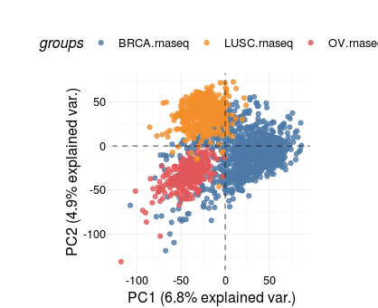
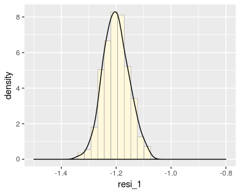
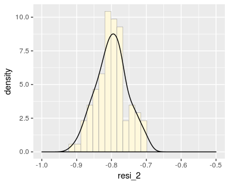

## Abstract
An important step to precision medicine is to identify homogeneous population from the heterogeneous population to allow specific treatment for each homogeneous subgroup. This paper considers the population where every sample is affected by the same certain observed covariates with heterogeneity, which means that heterogeneity arises from the unobserved latent factors. On the basis of the study of Professor Huang, this paper discusses mainly the situation of $p \gg n$. Firstly, we establish a linear model with subject-specific interprets. We then propose to apply MCP to this linear regression for estimating parameters which automatically divides the heterogeneous population into subgroups. Futhermore, in order to implement the procedure of estimating, this paper develops the ADMM algorithm with minimax concave penalty (MCP, Zhang, 2010) for estimating. Finally, we further illustrate the validity of our proposed model in identifying heterogeneous population and the accuracy and the applicability of the ADMM algorithm with MCP by simulation studies.

\bfseries Key words\mdseries: Subgroup analysis; Linear model with subject-specified intercepts; $p\gg n$; MCP; ADMM algorithm; Revised BIC


## 1 Introduction
In real life, patients with the same disease, for example, cancer patients, will have different clinical effects when they perform the same therapy, which manifests that they are from a heterogenous population. In order to improve the effectiveness of treatment, the United States put forward the concept of "accurate medicine" in 2011, which emphasizes the full use of personal genetic information to make medical decisions. In order to implement the "precise medical" policy, the heterogeneous group should be divided into multiple homogeneous subgroups, and then subgroup analysis should be done to carry out targeted treatment for each specific subgroup to improve the therapeutic effect. Shujie Ma, Huang Jian (2016) in [1], based on the subgroup analysis of Meta analysis in biostatistics, propose a new method to distinguish heterogeneous populations. In this paper,  they established a linear regression model with subject-specific intercepts. We apply concave penalty function to pairwise differences of the intercepts[1]. Then they developed a new ADMM algorithm to the problem. By this procedure, observations can be divided automatically.  However, in biomedical field, due to the high cost of sample data collection and a disease involving thousands of gene expression, it often results in the situation of $p \gg n$. In this case, the ordinary least square method doesn¡¯t work. Based on [1], we study the high dimensional problem, that is, when $p \gg n$, a linear model with subject-specified intercept is established. The intercepts and a number of parameters of independent variables are added to the penalty function term which also are concave penalties. Then we apply the ADMM algorithm proposed in [1] to our case. And we will verify that the coefficients can be estimated relatively accurately and observations can also be divided automatically by simulations and analyzing the TCGA-Ovary-cancer dataset. This is of standout significance to the realistic accurate medical treatment. The core of accurate medical treatment is to divide the heterogeneous population into homogeneous groups and apply specified medical measures to each of them to improve the accuracy of medical treatment. In the historical research, an important method a supervised clustering method. This method is to consider the heterogeneous population as coming from a mixture of subgroups and then establish a finite mixture model. Wei and Kosorok (2013) [2], Mc-Nicholas (2010) [3] proposed Gaussian mixture model. In addition, Muthen and Sharedden (1999) [4], Wong and Li (2001) [5], as well as the Muthen and Aspeahov (2009)[6] proposed the logistic-normal mixture model, and then Shen and He[7] improved the logistic-normal mixture model, bringing up a structured logistic-normal mixture model. On the other hand, Cai,Wong et al. (2011) [8] and Zhao, Cai et al. (2013) [9] using parametric method to construct a scoring system for cluster analysis. Foster, Taylor and Ruberg (2011) [10] put forward the method of "virtual twins" for the first time, and verified that the method is superior to the logical regression model. However, as a supervised clustering method, the proposed models assume that the sample distribution is known, which is difficult to satisfy in the practical research, especially for the mixture model method which should be put a priori on the number of mixture components. Therefore, the subject-specified intercepts linear model[1] will be used in this paper.

From an intuitive view, if analyzing the whole patient with a intercept-fixed linear model
$$Y_i=\mu+X_i^T\beta+\epsilon_i,i=1,\dots,n$$
which is based on the assumption of latent factors being negligible. However, the latent factors play a crucial role in medical decision-making under many usual situations. Thus we apply the subject-specified intercepts linear model[1]
$$Y_i=\mu_i+X_i^T\beta+\epsilon_i,i=1,\dots,n$$
where $\beta=(\beta_1,\dots,\beta_p)^T$ is a $p-$dimension vector, $\mu=(\mu_1,\dots,\mu_n)^T$ is an $n-$dimension vector and $p\gg n$. 

This model takes relating latent factors into consideration. Observation with same intercept are viewed as coming from a specific subgroup, and on the other hand, observations with different intercept are considered from different subgroups. Based on this subject-specified intercepts linear model, we can identify different subgroups from a hetergeneous population. In precision medicine, applying statistical tools to subgroup analysis, and futher to determine specific treatment to specific subgroup is of prospective importance.

A key issue is the choice of penalty functions. According to different aspects, relevant literatures have explored various forms of the application of penalty functions in variable selection. Tibshirani (1996) [11]proposed lasso method to estimate paremeters in linear model. Since then, many scholars have studied following up. Osborne, Presnell and Turlach (2000a, 2000b) [12, 13], Efron, Hastie and Johnstone (2004) [14] proposed algorithms such as LARS to solve lasso problem. Although lasso has many good properties, the estimators are biased, which are not consistent. Thus, Fan and Li (2001)[15] first focused on the influence of the bias of estimation deduced by lasso, implementing SCAD penalty[16] and showing that the obtained estimator has the oracle property. Zhang (2010)[17] proposed MC+ including the MCP penalty and the PLUS algorithm. It also proved the unbiasedness of the estimator, further showing that in the high-dimensional case, MC+ does not need to satisfy the two necessary preconditions of lasso, and it is more likely to obtain high-precision estimation than the lasso penalty. The solutions obtained from the proposed concave penalty function are not globally optimal, but it solves the problem of biased estimators and high cost of subset selection generated by lasso method. Thus concave penalties possess several attracting properties. Later, Patrick Breheny and Huang Jian (2011)[18] verified that the non-convex penalty function MCP and SCAD have more extensive than lasso, and further proved that MCP has a better estimation property than SCAD. Thus this project will apply MCP[17] penalty to the parameter selection.

Based on the proposed model, the next step is to find an algorithm with less iterations and higher precision. Hui Zou and Runze Li (2008)[19] proposed the LLA algorithm, and proved convergence and other theories system for this new algorithm applying to a large class of concave penalty functions. Friedman, Jerome et al. (2007)[20] applied the coordinate descent method to the lasso problem. Later, Wu and Lange(2008)[21] proposed the coordinate descent method with convex penalty, especially appying the $L_1$ penalty function, the $L_2$ penalty function, and the penalty function  combined with $L_1$ and $L_2$ to generalized linear model, effectively solving the sparse problem and shortening the computation time. Subsequently, Based on the introduction of the principle of coordinate descent method, Friedman, Hastie and Tibshirani (2010)[22] extended its convergence property, and illustrates the application of the algorithm in the field of machine learning. Thus, it can be seen that the coordinate descent method has stronger applicability in fitting the model with lasso penalty function than LARS. However, due to the time consumption and support of hardware, some algorithms cannot be used to implement the parameter estimation under realistic conditions. In order to comprehensively solve such problems, this project will apply the ADMM algorithm introduced by Stephen Boyd (2010)[23]. The ADMM algorithm combines the decomposability of the dual ascending method[24] and the upper bound convergence of the multiplier method [25]. It is a general algorithm for a well-implemented distributed computing framework. Even though the ADMM algorithm has a slower convergence rate than the fast and   of high-precision algorithms, such as the Newton method [26] and the interior point method [27], the estimation of high-precision are not significant for the effect of prediction in the large-scale application. Thus relaxing the cessation condition to obtain a relatively precise solution is acceptable.

## 2 Computation and Algorithm
Assumed that $p\gg n$, we establish the subject-specified linear model
$$y_i=\mu_i+{\rm x}_i^T\beta+\epsilon_i, i=1,\dots,n \tag {2.1}$$
where $\beta=(\beta_1,\dots,\beta_p)^T$ is a $p-$dimension vector of the parameters. And $\epsilon_i$ is error term independent with covariates ${\rm x}_i$with $\mathbb{E}(\epsilon_i)=0, \mathbb{V}(\epsilon_i)=\sigma^2$. To estimate the model (1), we applied the concave pasiwise penalized least square approach proposed by Ma amd Huang. Applied MCP[Zhang, 2010] to the diffrences of intercepts $\mu_i-\mu_j, 1\le i<\le j$and the parameters $\beta_k, k=1,\dots,p$, we can obtain
$$Q_n(\mu,\beta;\lambda,\omega)=\frac{1}{2}\sum_{i=1}^n(y_i-\mu_i-{\rm x}_i^T\beta)^2+\sum_{1\le i< j\le n}p_{\gamma}(|\mu_i-\mu_j|,\lambda)+\sum_{k=1}^pp_{\gamma}(|\beta_k|,\omega)\tag{2.2}$$
where
$$p_{\gamma}(t,\lambda)=\lambda\int_0^t(1-\frac{x}{\gamma\lambda})_+dx,\gamma>1$$
And the sign $(x)_+$ means that
$$(x)_+=\begin{cases}x,x>0\\0,x\le 0\end{cases}$$
In (2.2), $\lambda,\omega$ are tuning parameters, and $\gamma$ is a parameter reflecting the convexity of minimax penalized function(MCP). Breheny P and Huang J (2011) combined Bayesian Information Criterions(BIC), cross-validation and convexity diagnostics[] to find that a low value of $\gamma = 1.5$ well balances the sparsity and convexity in their setting($n>p$). They also suggests large value of $\gamma$ would be better in the case $p\gg n$. However, with $\gamma\to\infty$, MCP converges to $L_1$ penalty, and then cause bias. Thus, we choose fixed $\gamma=3$. 

For fixed $\lambda,\ \omega$, denote
$$(\hat{\mu}(\lambda,\ \omega),\ \hat{\beta}(\lambda,\ \omega))={\rm arg min}_{\mu,\beta}Q_n(\mu,\beta;\lambda,\omega)$$
Proposed by Ma and Huang(2016), we assumed that $\hat{\alpha}_1,\dots,\hat{\alpha}_{\hat{K}}$ are the distinct values of $\hat{\mu}$, and $\hat{\mathcal{G}}_k=\{i: \hat{\mu}_i=\hat{\alpha}_k,1\le i\le n\},a\le k\le \hat{K}$. Thus $\{\hat{\mathcal{G}_1},\dots,\hat{\mathcal{G}_{\hat{K}}}\}$ constitutes a partition of $\{1,\dots,n\}$, i.e. the $n$ subjects. 

It is difficult to compute the estimates directly by minimizing the objective function (2.2) due to the fact that the penalty function is not seperable in $\mu_i's$[1]. Thus we introduce a new set of parameters $\eta_{ij}$ defined by 
$$\eta_{ij}=\mu_i-\mu_j$$
Denote
$$\eta = \{\eta_{ij},i<j\}^T$$
Then the (2.2) is equivalent to 
$$\min S_n(\mu, \beta,\eta;\lambda,\omega)=\frac{1}{2}\sum_{i=1}^n(y_i-\mu_i-{\rm x}_i^T\beta)^2+\sum_{1\le i< j\le n}p_{\gamma}(|\eta_{ij}|,\lambda)+\sum_{k=1}^pp_{\gamma}(|\beta_k|,\omega)\tag{2.3}$$
$$s.t.\ \mu_i-\mu_j=\eta_{ij}$$
Trough Augmented Lagrange multiplier method, we can obtain
$$L(\mu,\beta,\eta,\nu)=S_n(\mu,\eta,\beta)+\sum_{1\le i<j\le n}\nu_{ij}(\mu_i-\mu_j-\eta_{ij})+\frac{\vartheta}{2}\sum_{1\le i<j\le n}(\mu_i-\mu_j-\eta_{ij})^2\tag{2.4}$$
where $\vartheta$ is the penalty parameter and $\nu=\{\nu_{ij}\,i<j\}^T$ are Lagrange multipliers. 

### 2.1 Compute $\hat{\eta_{ij}}$
For $\eta$ is independent of $\mu$ and $\beta$, then we can view the terms without $\eta$ as constants. Applied Square root formula, (2.4) can be replaced by
$$L(\mu,\eta,\beta,\nu)=\sum_{1\le i<j\le n}\left\{\frac{\vartheta}{2}(\mu_i-\mu_j+\vartheta^{-1}\nu_{ij}-\eta_{ij})^2+p_{\gamma}(|\eta_{ij}|,\lambda)\right\}+C_1\tag{2.5}$$
Therefore minimize (2.5) is equivalent to minimize
$$\frac{\vartheta}{2}(\mu_i-\mu_j+\vartheta^{-1}\nu_{ij}-\eta_{ij})^2+p_{\gamma}(|\eta_{ij}|,\lambda)\tag{2.6}$$
Let
$$\delta_{ij}=\mu_i-\mu_j+\vartheta^{-1}\nu_{ij}$$
And (2.6) can be
$$\frac{\vartheta}{2}(\delta_{ij}-\eta_{ij})^2+p_{\gamma}(|\eta_{ij}|,\lambda)\tag{2.7}$$
Denote 
$$\delta = \{\delta_{ij},i<j\}^T$$
We can obtain given $\delta^{(m+1)}$ at the $m-$step, we can update $\eta^{(m+1)}$ whose elements are the minimizer of (2.7) as
$$\eta^{(m+1)}=\begin{cases}\frac{ST(\delta^{(m+1)},\lambda/\vartheta)}{1-1/\gamma\vartheta},|\delta^{(m+1)}|\le \gamma\lambda\\ \delta^{(m+1)}, |\delta^{(m+1)}|>\gamma\lambda\end{cases}\tag{2.8}$$
where $ST(t,\lambda)=sign(t)(|t|-\lambda)_+$ is the soft-therosholding function. And given $\nu^{(m)}$ at the $m-$step and$\mu^{(m+1)}$ at the $(m+1)-$step, the update $\delta^{(m+1)}$ is $$\delta^{(m+1)}=\Delta\mu^{(m+1)}-\frac{1}{\vartheta}\nu^{(m)}$$
where$\Delta=\{e_i-e_j,i<j\}^T, e_i$ is a $n$-dimension vector with the $i-$th component 1 and others 0.

### 2.2 Compute $\hat{\mu}$
Denote that $\|\rm x\|$ is the $L_2$ norm. For the same sake, we can view terms without $\mu$ as a constant. Then (2.4) can be replaced by
$$L(\mu,\eta,\beta,\nu)=\frac{1}{2}\sum_{i=1}^n(y_i-\mu_i-{\rm x}_i^T\beta)^2+\sum_{1\le i<j\le n}\nu_{ij}(\mu_i-\mu_j-\eta_{ij})+\frac{\vartheta}{2}\sum_{1\le i<j\le n}(\mu_i-\mu_j-\eta_{ij})^2+C_2\tag{2.9}$$
Let $X=({\rm x}_1,\dots,{\rm x}_p)^T$, then (2.9) can be replaced by
$$\begin{aligned} L(\mu,\eta,\beta,\nu)&=\frac{1}{2}\|y-\mu-X\beta\|^2+\frac{\vartheta}{2}\sum_{1\le i<j\le n}(\mu_i-\mu_j-\eta_{ij}+\vartheta^{-1}\nu_{ij})^2+C_3\\
&=\frac{1}{2}\|y-\mu-X\beta\|^2+\frac{\vartheta}{2}\sum_{1\le i<j\le n}\left\{(e_i-e_j)\mu-\eta_{ij}+\vartheta^{-1}\nu_{ij}\right\}^2+C_3\\
&=\frac{1}{2}\|y-\mu-X\beta\|^2+\frac{\vartheta}{2}\|\Delta\mu-\eta+\vartheta^{-1}\nu\|^2+C_3
\end{aligned}$$
Let
$$\frac{\partial L(\mu,\eta,\beta,\nu)}{\partial \mu}=-(y-\mu-X\beta)+\vartheta\Delta^T(\Delta\mu-\eta+\vartheta^{-1}\nu)=0$$
Given $\eta^{(m)},\nu^{(m)},\beta^{(m)}$ at the $m-$step, we obtain
$$\mu^{(m+1)}=(E_{n\times n}+\vartheta\Delta^T\Delta)^{-1}(\vartheta\Delta^T\eta^{(m)}-\Delta^T\nu^{(m)}+y-X\beta^{(m)})\tag{2.10}$$
where $E_{n\times n}$ is $n$-dimension unit matrix.

### 2.3 Compute $\hat{\beta}$
Also for the same sake, we can consider terms without $\beta$ as a constant. Then (2.4) can be transformed into
$$\begin{aligned} L(\mu,\eta,\beta,\nu)&=\frac{1}{2}\sum_{i=1}^n(y_i-\mu_i-{\rm x}_i^T\beta)^2+\sum_{k=1}^pp_{\gamma}(|\beta_k|,\omega)+C_4\\
&=\frac{1}{2}\|y-\mu-X\beta\|^2+\sum_{k=1}^pp_{\gamma}(|\beta_k|,\omega)+C_4
\end{aligned}\tag{2.10}$$
Let $\tilde{y}=y-\mu$, then (10) is equivalent to 
$$L(\mu,\eta,\beta,\nu)=\frac{1}{2}\|\tilde{y}-X\beta\|^2+\sum_{l=1}^pp_{\gamma}(|\beta_l|,\omega)+C_4\tag{2.11}$$
The solution of (2.11) is given by Patrick B.(2011), that is, given $\mu^{(m+1)}$ at the $(m+1)-$step, the update is
$$\beta^{(m+1)}=\begin{cases}\frac{ST(n^{-1}X^T\tilde{y}^{(m+1)},\omega)}{1-1/\gamma},|n^{-1}X^T\tilde{y}^{(m+1)}|\le\gamma\omega\\ n^{-1}X^T\tilde{y}^{(m+1)},|n^{-1}X^T\tilde{y}^{(m+1)}|>\gamma\omega\end{cases}\tag{2.12}$$
where $\tilde{y}^{(m+1)}=y-\mu^{(m+1)}$. And this can be estimated in the ncvreg R-package by Breheny P. and Huang J. (2011).

### 2.4 Stopping criterion
We are concerned about the precision of the estimates $\hat{\beta}_k,1\le k\le p$, $\hat{\mu}_i-\hat{\mu}_j-\hat{\eta}_{ij},1\le i < j\le n$ and the heterogeneous group numbers $\hat{K}$. Due to $\hat{K}$ comes from $\hat{\mu}_i-\hat{\mu_j}-\hat{\eta}_{ij}$ direcly, we only take the first two factors into consideration. Define
$$\begin{aligned}D^{(m+1)}_{\mu} &= \left\{(\Delta\mu^{(m+1)}-\eta^{(m+1)})^T(\Delta\mu^{(m+1)}-\eta^{(m+1)})\right\}^{\frac{1}{2}}\\
D_{\beta}^{(m+1)}&=\left\{ (\beta^{(m+1)}-\beta^{(m)})^T(\beta^{(m+1)}-\beta^{(m)})\right\}^{\frac{1}{2}}
\end{aligned}$$
Let $\|s\|_w$ be the weighted average norm by weighting the values of norms applied to every elements of $s$. In this paper, we terminate the iteraction when $\|D^{(m+1)}\|_w$ is less than a pre-defined tolerance, where $D^{(m+1)}=(D_{\mu}^{(m+1)},D_{\beta}^{(m+1)})$, and $\|D^{(m+1)}\|_w=\omega_0\|D_{\mu}^{(m+1)}\|+\omega_1\|D_{\beta}^{(m+1)}\|, \omega_0+\omega_1=1$. The choice of $\omega_i,i=0,1$ depends on what you more cares about. In our setting, the precision of $\hat{\mu}$ and $\hat{\beta}$ are promoted mutually. Thus in the simulation and empirical analysis, we take $\omega_0=\omega_1=0.5.$ 

### 2.5 Algorithm
By ADMM, we can obtain the iteration function of $\nu$ is 
$$\nu^{(m+1)}=\nu^{(m)}+\vartheta(\Delta\mu_{(m+1)}-\eta^{(m+1)})$$
Therefore, the algorithm is as follows.

|Algorithm(ADMM with concave penalized function) |
|:------------------------------------------------------------------------------------------------------------------------------------------------|
|Input: Covariate matrix $X=({\rm x}_1,\dots,{\rm x}_p)$, and response variables $y=(y_1,\dots,y_n)^T$|
|1:Initilize $(\beta^{(0)},\mu^{(0)},\eta^{(0)},\nu^{(0)})$, where |
|$\ \ \beta_l^{(0)}\sim U[0,1],l=1,\dots,p$, $\mu^{(0)}=y-X\beta^{(0)}$,$\eta_{ij}^{(0)}=\mu_i^{(0)}-\mu_j^{(0)}$, $\nu^{(0)}=0$| 
|2:while not converged (i.e. $\|\Delta\mu^{(m+1)}-\eta^{(m+1)}\|<\zeta$) do|
|3:$\mu_{(m+1)}=(E_{n\times n}+\vartheta\Delta^T\Delta)^{-1}(\vartheta\Delta^T\eta^{(m)}_y-X\beta^{(m+1)})$|
|4:If $\| n^{-1}X^T\tilde{y}\|\le \gamma\omega$, do|
|$\quad\quad\beta^{(m+1)}=\frac{ST(n^{-1}X^T\tilde{y}^{(m+1)},\omega)}{1-1/\gamma}$|
|5:else do|
|$\quad\quad\beta^{(m+1)}= n^{-1}X^T\tilde{y}^{(m+1)}$|
|6:If $\|\delta^{(m+1)}\|\le \gamma\lambda$, do|
|$\quad\quad\eta^{(m+1)}=\frac{ST(\delta^{(m+1)},\lambda/\vartheta)}{1-1/\gamma\vartheta}$|
|7:else do|
|$\quad\quad\eta^{(m+1)}= \delta^{(m+1)}$|
|8:$\nu^{(m+1)}=\nu^{(m)}+\vartheta(\Delta\mu_{(m+1)}-\eta^{(m+1)})$|
|9:end while|
|Output:$(\hat{\beta},\hat{\mu},\hat{\eta},\hat{\nu})$|

The convergence of the algorithm has been proved by Ma S.J ang Huang J(2016)[1]. In practical applications, due to the slow convergence speed of ADMM algorithm,  this algorithm is often used in combination with other algorithms to improve the convergence speed of the algorithm while ensuring the unbiased iterative process. 

### 2.6 Selection of tunig parameters
According to the research at home and abroad, there are mainly three kinds of tuning parameter selection methods. The first type of method includes Akaike Information Criterion(AIC) proposed by Akaie(1973), Bayesian Information Criterion proposed by Schwarz(1978) which modifies and perfectes AIC criterion and Wang and Li(2007) et al. implemented the BIC putting forward revised BIC. The second method is the stable selection proposed by Meinshausen and Buhlmann(2009) [31]. The third one is the cross-validation method. Allen(1974) [32], Herzberge and Tsukanove(1986) [33] et al. introduced the Leave-one-out cross-validation (LOO) and its application. Shao (1993) introduced the application of $K-$fold cross-validation. In this paper, revised BIC is used. Given $\gamma,\vartheta$, every pair of tunig parameters $(\lambda,\omega)$ matches a value of BIC as 
$$BIC(\lambda,\omega)=\log\left[\frac{\sum_{i=1}^n\left(y_i-\hat{\mu}_i(\lambda,\omega)-{\rm x}_i^T\hat{\beta}(\lambda,\omega)\right)^2}{n}\right]+C_n\frac{\log n}{n}\left(\hat{K}(\lambda,\omega)+p\right)\tag{2.13}$$
where $C_n$ is a positive numbers depending on sample size $n$. With $C_n=1$, the revised BIC is indeed the traditional BIC. Wang, LI, and Leng(2009) suggests
$$C_n=c\log(\log(n+p))$$
where $c$ is a positive number. The pair $(\lambda,\omega)$ minimized $BIC(\lambda,\omega)$ is applied to the model fit.

## 3 Emperical example
### 3.1 Data description 
I find a gene expression data sets for ovarian cancer(OV) patients from The Cancer Genome Atlas(TCGA). This dataset can be downloaded through the "RTCGA" package.

```{R, eval = FALSE}
#source("http://bioconductor.org/biocLite.R")
#biocLite("RTCGA")
#biocLite("RTCGA.clinical")
#biocLite("RTCGA.rnaseq")
#biocLite("RTCGA.mRNA")
#biocLite("RTCGA.mutations")
```

```{R, results = 'hide'}
library(RTCGA)
#library(RTCGA.clinical)
#library(RTCGA.rnaseq)
library(RTCGA.mRNA)
#library(RTCGA.mutations)
#install.packages("VIM")
library(VIM)
#install.packages("dplyr")
library(dplyr)
#library(tidyr)
#library(wakefield)
#install.packages("Amelia")
library(Amelia)
#library(mice)
#library(ggpubr)

expr = expressionsTCGA(OV.mRNA) 
```


First, we find that the dataset is equipped with 17814 genes expression levels for 561 cancers. 

```{R}
dim(expr)
```

```{R}
head(expr)
expr[1:5, (dim(expr)[2] - 2): dim(expr)[2]]
```

For convenience, I simplify the notation of the dataset.

```{R}
expr = expr %>% mutate(bcr_patient_barcode = 1 : 561) %>% 
  mutate(bcr_patient_barcode = paste0('OV',bcr_patient_barcode))
  
head(expr)
```

Next, I explored whether there are missing data in the dataset or not. For the dataset is so numerical, I just plot two subsets of the dataset.

```{R}

missmap(as.data.frame(expr[1 : 561, 2 : 100]), 
        col = c("red", "lightyellow"), 
        x.cex = 0.7, y.cex = 0.2, 
        rank.order = F)
# missmap(expr[1 : 561, 101 : 200],
#         col = c("red", "lightyellow"),
#         x.cex = 0.7, y.cex = 0.2, rank.order = F)

```

And indeed, it has some missing data. Thus the next step, I delect the missing data.

```{R}
expr = expr[, -c(1, dim(expr)[2])] %>% apply(2, as.numeric)
expr_comp = expr %>% t %>% na.omit %>% t
(dime = dim(expr_comp))
```

Then just 17439 genes expression levels for 561 patients are used in the later analysis.

Seiden MV (2012)[36] proposed that mutations in BRCA1 have a lifetime risk of developing ovarian cancer of 15¨C45%. And mutations in BRCA2 are less risky than those with BRCA1, with a lifetime risk of 10%. To verify that, I find another two unrelated datasets, one is Breast invasive carcinomaBreast invasive carcinoma(BRCA) and another is Lung squamous cell carcinoma(LUSC). The next plot shows that the LUSC datasets is mor far away from the OV. 

```{R, eval = FALSE}
expressionsTCGA(BRCA.rnaseq, OV.rnaseq, LUSC.rnaseq) %>%
  dplyr::rename(cohort = dataset) %>%  
  filter(substr(bcr_patient_barcode, 14, 15) == "01") = BRCA.OV.LUSC.rnaseq.cancer

pcaTCGA(BRCA.OV.LUSC.rnaseq.cancer, "cohort") = pca_plot
plot(pca_plot)

```



Therefore, I compared the BRCA1 and BRCA2 expression levels of OV with those of LUSC. The Boxplot shows that the BRCA1 expression level is more important index of ovarian cancer than BRCA2 to some extent. 

```{R}
#install.packages("plotly")
#install.packages("ggpubr")
library(ggplot2)
library(plotly)
library(ggpubr)
expr_com = expressionsTCGA(OV.mRNA, LUSC.mRNA)
expr_com$dataset = gsub(pattern = ".mRNA",
                       replacement = "", expr_com$dataset)
expr_com$bcr_patient_barcode = paste0(expr_com$dataset,
                                     c(1 : 561, 1 : 154))

p = ggboxplot(expr_com, x = "dataset", y = c("BRCA1", "BRCA2"),
          combine = T, ylab = "Expression",
          color = "dataset", palette = "lacet")

#ggplotly(p)
p

```

Thus, I chosen the BRCA1 as index of the ovarian cancer and also the response variable. However, as historical research said that, the mutation in BRCA1 is related to ovarian cancer. In addition, some other variables are also used to check ovarian problem including the expression of BRCA2, Ovulation level, and also involving some categorical variables, such as, hormone therapy after menopause, fertility medication, and obesity.  We use the fitted value of the gene expression of BRCA1 as the response variable by projecting it onto the linear space spanned by the related variables. Our interest is to conduct subgroup analysis for the fitted value of gene expression of BRCA1 as the response $y$ after adjusting for the effects of the covariates: $x_1$=ELMO2, $x_2$=CREB3L1, $x_3$=RPS11, $x_4$=PNMA1 and other relative 700 genes' expression. 

Firstly, traditional linear model is applied to them.

```{R}
BRCA1 = expr_comp[ , which(colnames(expr_comp) == 'BRCA1')]
corr = expr_comp %>% apply(2, function(x){cor(x, BRCA1)})
corr_dec = corr %>% abs %>% sort(decreasing = T)
corr_df = corr %>% as.data.frame %>% rownames %>% as.data.frame
corr_df$corr = abs(corr)
genes_rel = corr_df %>% filter(corr > corr_dec[4])
colnames(genes_rel) = c("Index", "corr")
genes_rel = filter(genes_rel, Index != "BRCA1")
genes_rel_name = genes_rel[,1] %>% as.character

fit_df = expr_comp %>% as.data.frame
fit_df = select(fit_df , genes_rel_name)
lm_fit = lm(BRCA1~., data = fit_df)
y_hat = lm_fit$fitted.values

ecn_df = expr_comp %>% t %>% as.data.frame
ecn_df$Index = colnames(expr_comp)
for(i in (1 : length(genes_rel_name))){
  ecn_df = ecn_df %>% filter(Index != genes_rel_name[i])
}
ecn_df = ecn_df %>% filter(Index != "BRCA1")
ecn_x = ecn_df

y_emp = y_hat %>% as.matrix
x_emp = ecn_x[, -dim(ecn_x)[2]] %>% t
x_emp = x_emp[, 200:900]

#install.packages("ncvreg")
library(ncvreg)
cvfit = cv.ncvreg(x_emp, y_emp)
fit = cvfit$fit
betancv = fit$beta[,cvfit$min]
betancv = betancv[-1]
res = y_emp - x_emp %*% betancv
res = res %>% as.data.frame
colnames(res) = "resi"

pp = ggplot(res, aes(x = resi, y = ..density..)) + 
  geom_histogram(fill = "cornsilk", colour = "grey60", size = 0.2) + 
  geom_density() + xlim(-3, 1)

#ggplotly(pp)
pp

```


From the kenel density plot of the residuals, we can see that there still not from one normal population. In other words, there still exist some important latent variables which affect the BRCA1.

Thus then, I chose the top three most relevant variables with BRCA1. And then projected the gene expression level of BRCA1 onto the linear space spanned by these three varialbles. We then chose the tail 701 variables in the dataset as the explanatory variables, and then plot the kernel density estimates of $y_i-x_i^T\hat{\beta}^{ncv}$, where $\hat{\beta}^{ncv}$ is estimated by a ordinary linear model with penalty function.

Clearly, we see that after adjusting for the effects of the covariates, the distribution still shows multiple modes. The heterogeneity may be caused by some unobserved latent factors. Hence, it is not suitable to fit a standard linear regression model with a common intercept by using the response and the predictors. Instead, we fit the heterogeneous mode
$$y_i=\mu_i+x_i^T\beta+\epsilon_i,i = 1, \dots,561$$
And then use ADMM method, the data set can be divided into 4 groups, with 431, 126, 3 and 1 respectively. Thus indeed there are two groups. 

```{R, eval = F}
res_df = rep(0, times = length(y_emp)) %>% as.factor %>% as.data.frame
colnames(res_df) = "group"
res_df$group[1 : 127] = rep(1, times = 127)
res_df$group[128: (127 + 431)] = rep(2, times = 431)
library(RTCGA)
res_df$group[557] = 3
res_df$group[558:561] = rep(4, times = 3)
res_4 = (group_4[, 1] - group_4_mu - group_4[, -1] %*% beta_hat_emp) %>% as.data.frame
colnames(res_4) = "resi_4"
res_com = c(res_1$resi_1, res_2$resi_2, res_3$resi_3, res_4$resi_4)
res_df$res = res_com
ggplot(data = res_df, aes(x = group, y = res)) + geom_boxplot(aes(fill = group))

```

The boxplot shows that there exists heterogeneity among the four groups.

```{R, eval = F}
data_ov = cbind(y_emp, x_emp)
lam_ome_emp = Lam_Ome_opt_BIC_para(x_emp, y_emp, grid_num_lam = 8, grid_num_ome = 8)
lambda_emp = lam_ome_emp[[1]]
omega_emp = lam_ome_emp[[2]]
result_emp = estimation_ADMM(x_emp, y_emp, lambda_emp, omega_emp)
gr_num = result_emp[[1]]
gr_mem_emp = result_emp[[4]] %>% group_member(n = length(y_emp))
group_1_ser = gr_mem_emp[1, ] %>% na.omit 
group_1 = data_ov[group_1_ser, ] %>% as.matrix
group_2_ser = gr_mem_emp[2, ] %>% na.omit
group_2 = data_ov[group_2_ser, ] %>% as.matrix
group_3_ser = gr_mem_emp[3, ] %>% na.omit
group_3 = data_ov[group_3_ser, ] %>% as.matrix %>% t
group_4_ser = gr_mem_emp[4, ] %>% na.omit
group_4 = data_ov[group_4_ser, ] %>% as.matrix
group_1_mu = result_emp[[2]][group_1_ser[1]]
group_2_mu = result_emp[[2]][group_2_ser[1]]
group_3_mu = result_emp[[2]][group_3_ser[1]]
group_4_mu = result_emp[[2]][group_4_ser[1]]

beta_hat_emp = result_emp[[3]]

res_1 = (group_1[, 1] - group_1_mu - group_1[, -1] %*% beta_hat_emp) %>% as.data.frame
colnames(res_1) = "resi_1"
res_2 = (group_2[, 1] - group_2_mu - group_2[, -1] %*% beta_hat_emp) %>% as.data.frame
colnames(res_2) = "resi_2"
res_3 = (group_3[, 1] - group_3_mu - group_3[, -1] %*% beta_hat_emp) %>% as.data.frame
colnames(res_3) = "resi_3"
res_4 = (group_4[, 1] - group_4_mu - group_4[, -1] %*% beta_hat_emp) %>% as.data.frame
colnames(res_4) = "resi_4"

p1 = ggplot(res_1, aes(x = resi_1, y = ..density..)) + 
  geom_histogram(fill = "cornsilk", colour = "grey60", size = 0.2) + 
  geom_density() +xlim(-1.5, -0.8)
#ggplotly(p1)
p1

p2 = ggplot(res_2, aes(x = resi_2, y = ..density..)) + 
  geom_histogram(fill = "cornsilk", colour = "grey60", size = 0.2) + 
  geom_density() + xlim(-1, -0.5)
#ggplotly(p2)
p2
```

group 1



group 2



And the kenel desity show that group 1 and group 2 are both homogeneous subgroups.